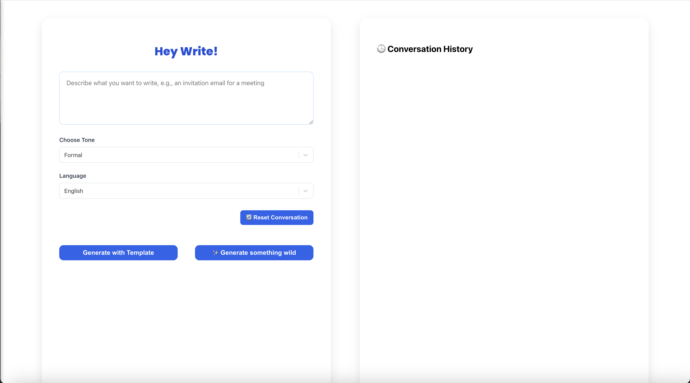

# ✨ HeyWrite - AI Smart Writing Assistant

HeyWrite is a smart AI-powered writing assistant that helps you draft professional content based on your intent, tone, and language — all with just one sentence.

Now enhanced with Retrieval-Augmented Generation (RAG), custom templates, multi-turn memory, and more — HeyWrite makes writing faster, smarter, and more personalized.

---

## 🌐 Live Demo

- https://hey-write.vercel.app/

---

## 🚀 Features

-  Generate instant writing drafts from your one-sentence intent
- Choose between two generation modes:
    - Generate with templates: AI automatically matches your input to a relevant predefined template using vector search
    - Generate something wild: Freely generate content without relying on templates
- Your intent is automatically matched to the most relevant template using vector search. If no suitable template is found, the app suggests using wild mode for freeform generation.

- Maintains **multi-turn conversation history**
- Revisit previous results and modify based on that
- Clear chat history and start a new conversation
- Summarize and highlight the changes made between the previous version and the newly generated content
- Control tone and style: Formal, Casual, Polite Push, Concise & Direct, Humorous, or Creative
- Supports **English**, **Chinese**, and **Danish**
- One-click copy of generated content

---

## ⚙️ Tech Stack

| Category        | Technology                            |
|----------------|----------------------------------------|
| **Frontend**    | React + TypeScript (deployed via Vercel)|
| **Backend**     | FastAPI (deployed on Render) |
| **AI Model**    | DeepSeek Chat API                     |
| **Embedding**   | OpenAI Embeddings (`text-embedding-3-small`)  |
| **Vector Store**| ChromaDB                              |
| **Frameworks**  | LangChain for RAG and template routing |
| **Deployment**  | Render + Docker+ GitHub Actions |
---


## 🧱 Build / Rebuild Vector DB

When templates change, or when switching embedding models, rebuild Chroma:

```bash
cd chatbox-backend
python3 chroma_setup/chroma_db.py
```


## 📂 Architecture Overview

1. **Intent Input** →  
2. **Vector Search (Chroma + LangChain Retriever)** →  
3. **LLM Prompting with Context** →  
4. **Document Draft Output**  
5. **Editable + Copyable + Chat History Aware**

Template mode uses vector similarity distance for match gating (`similarity_search_with_score`), with default threshold `SIMILARITY_THRESHOLD = 0.65` (configurable via env var) in `chatbox-backend/langchain_runner/rag_chain.py`.

## 🖥️ Local Run

Prerequisites:
- Python 3
- Node.js + npm

Run frontend + backend with one command:

```bash
./run_local.sh
```

Script behavior:
- Auto-creates `chatbox-backend/.venv` if missing
- Starts backend at `http://127.0.0.1:8000`
- Starts frontend via CRA dev server

Stop:
- Close the frontend terminal session (the script then stops backend as well)


## 📸 Screenshots

### Web Demo


---


### Web UI

  

#### 📄 User Case: Project Weekly Report  
<div style="display: flex; gap: 10px; flex-wrap: wrap;">
      
      
      
</div>

#### ⚠️ No Matched Template (using "Generate with templates" button)  
<div style="display: flex; gap: 10px; flex-wrap: wrap;">
    
</div>

#### 📑 User Case: Contract Risk Review  
<div style="display: flex; gap: 10px; flex-wrap: wrap;">
    
    
    
    
</div>

---

### Mobile UI


<div style="display: flex; gap: 10px; flex-wrap: wrap;">
    
    
    
    
</div>
